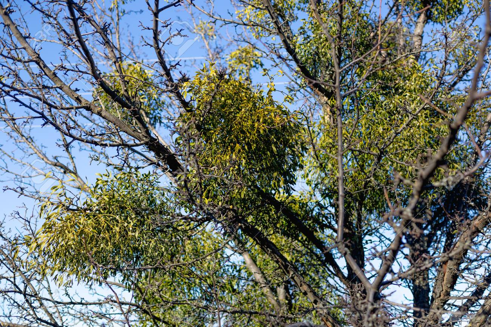
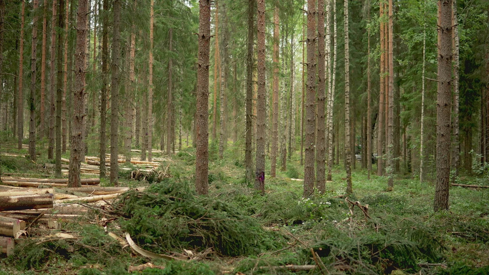
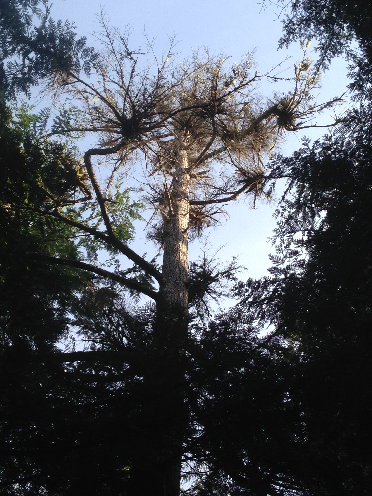

Homework \#4: GLMMs with multiple variables: Confounds, Interactions,
and Categorical Variables
================

For the questions below, you may use any tools we have discussed in
class to examine or visualize model results (e.g. summary(), coef(),
predict(), plot_model, link functions, etc).



Above: Dozens of mistletoe plants (*Viscum album*) infecting a tree’s
canopy.

# Question 1:

Question 1 involves a dataset about the impacts of mistletoe infection
in Spanish forests, published in Functional Ecology:
<https://besjournals.onlinelibrary.wiley.com/doi/pdf/10.1111/1365-2435.12907>

Mellado and Zemora (2016). *Parasites structuring ecological
communities: The mistletoe footprint in Mediterranean pine forests.
Functional Ecology.*

Mistletoe is a plant that parasitizes trees, tapping into their water
and nutrient resources. Mistletoe has very sticky seeds, which spread
through the canopy of a tree when birds eat them and drop these sticky
seeds on other parts of the tree below. When mistletoe abundantly
infects a tree’s canopy, it can cause tree canopy dieback and
eventually, mortality.

The authors of this study assessed the impacts of mistletoe on forest
regeneration, measuring the abundance of seedlings below trees that were
either parasitized by mistletoe or not parasitized. They hypothesized
that mistletoe changes light availability and soil fertility beneath the
canopies of parasitized trees, facilitating recruitment of seedlings
below these weakened trees and shifting the community composition in
these forests.

``` r
mistletoe <- read.csv("mistletoes.csv")
head(mistletoe)
```

    ##   TreeID     Treatment Seedlings Year
    ## 1      1   parasitized         8 2011
    ## 2      2 unparasitized         0 2011
    ## 3      3   parasitized       153 2011
    ## 4      4 unparasitized         0 2011
    ## 5      5   parasitized        40 2011
    ## 6      6 unparasitized         0 2011

The full paper includes many variables, but we will focus just on the
following variables:

**TREATMENT** = A categorical variable describing whether a tree is
parasitized by mistletoe or not  
**SEEDLINGS** = A count of the number of seedlings in 5m x 5m plots
beneath parasitized and unparasitized trees, during the authors’ 2011
and 2012 surveys.  
**YEAR** = Whether the survey was taken in 2011 or 2012.

## Question 1: Mistletoe impacts on seedlings

**1a) (4 pts)** Fit a glm assessing evidence for the following
hypothesis: Seedling density is increased beneath trees experiencing
mistletoe infection. Describe the rationale you used in selecting a glm
structure and probability distribution.

**1b) (5 pts)** Based on your fitted model and a metric of model fit (of
your choosing), write 2-4 sentences to answer the following biolgical
conclusions:  
Does mistletoe infection alter seedling density? How much does seedling
recruitment differ beneath parasitized and unparasitized trees? Explain
which elements of your glm results informed your conclusions and the
steps you needed to take to interpret your parameters. You are welcome
to present a graph or the estimates as numbers.

**1c) (4 pts)** During the course of this study, 2012 was an atypically
rainy year, compared to 2011. Fit an additional glm that quantifies how
the effect of mistletoe differs between the two years in this study.
Write ~2 sentences that summarize the results of the new model and their
biological implications.



*Above: A forest stand following a thinning treatment.*

# Question 2:

Questions 2 uses the “treemortality” dataset in this repository. Forest
thinning is a forest management approach that aims to remove woody fuels
from forests before wildfires to reduce subsequent severity of these
disturbances. This data set examines the effects of a forest thinning
treatment on tree mortality in a subsequent wildfire in forests in the
Sierra Nevada mountains.

In 2019, researchers measured the diameters of \>10,000 Ponderosa pine
trees. Following this initial survey, some of the sampled areas happened
to receive thinning treatments, applied by the US Forest Service in
2020-2022, in a fashion unrelated to the researchers’ original study
design. In 2023, a large portion of their sampled area then burned in a
wildfire, creating a “natural experiment.”

In Fall 2023, the researchers returned to re-sample survival 1000 of
these trees, to determine whether past thinning actions helped reduce
tree mortality (0=survived; 1=died). They recorded mortality, tree size
(cm in diameter), and whether the tree was located in an area that had
received a thinning treatment (**thinning**, a categorical variable,
where 1 indicates that the plot received a thinning treatment). Due to
the observational nature of their study, the researchers were worried
about possible confounding relationships generated by the fact that: a)
thinning treatments were more likely to occur in stands with lots of
small trees, rather than larger diameter trees, and b) larger trees are
more likely to survive fire. Therefore, they resampled the 1000 trees in
a randomized fashion by tree size, to ensure that small and large stems
were recorded equally commonly across thinned and unthinned forests.

The researchers are interested in the following question: Does thinning
decrease the probability of tree mortality in wildfire?

``` r
treemortality <- read.csv("treemortality.csv")
head(treemortality)
```

    ##   X mortality thinning  roaddist    slope   treesize
    ## 1 1         0        1 1.4148852 23.34290 12.3003737
    ## 2 2         0        0 0.5419534 29.92641  6.9480055
    ## 3 3         0        1 1.6301725 17.94698  2.1784680
    ## 4 4         0        1 3.7380622 16.96357 10.5182755
    ## 5 5         0        1 3.3916483 25.06625  0.5099761
    ## 6 6         0        0 6.9336465 20.41989  9.7882557

**2a) (5 pts)** Fit a glm (using a probability distribution of your
choice) that reflects the following research question: Do forest
thinning treatments reduce the probability of tree mortality? Interpret
the results of the glm by writing 2-4 sentences about the biological
significance of the effect of thinning, including descriptions of the
sizes of the effect on the scale of the response variable, evidence
for/against the hypothesis, and a metric of model fit.

**2b) (2 pts)** The researchers explicitly considered the potential for
confounding relationships related to tree size in their design and
randomized their post-fire sampling by tree size. Given this
information, the researchers need to incorporate tree size into their
glm to accurately estimate the effect of thinning? Why or why not?

**2c) (5 pts)** The researchers submit their analysis for peer review,
and one of the reviewers raises some concerns about the sampling
methods. The researchers were unable to control the placement of forest
thinning treatments (which are controlled by a variety of ecological,
logistical, and political factors), so the reviewer is concerned about
confounding relationships that might bias the thinning effect.

In the reviewer’s experience, thinning treatments are not randomly
applied across the landscape, and tend to occur in places that are
easier to access with the heavy machinery required for thinning. For
instance, steeper slopes might be less likely to be thinned, and they
also tend to foster higher fire severities; similarly, forest patches
that are farther from the road may also be less likely to be thinned and
also experience higher fire severities, because they are farther away
from firefighting/fire suppression activities the occur more commonly
along roads. The reviewer sends the researchers the DAG below to
summarize their concerns and asks the researchers to fit a new model
that accounts for these confounding relationships. The researchers
calculate the slope of the terrain around each sampled tree and how far
each tree was from the nearest road, and add these variables (roaddist
(in km), and slope (in degrees)) to their dataset.

    ## 
    ## Attaching package: 'ggdag'

    ## The following object is masked from 'package:stats':
    ## 
    ##     filter

<!-- -->

Refit the model from 2a to include the necessary variables to minimize
bias in our estimation of the “thinning” variable, based on the
reviewer’s proposed DAG (above). Does the effect of “thinning” change?
If so, describe the degree of change and why the two models may differ
in their conclusions. If needed, modify your model interpretation from
2a.

*(It is not required to include any biological/ecological hypotheses
here that require additional or deeper knowledge about forest fires,
thinning treatments, etc – assume that the DAG proposed is complete.
Though feel free to come up with a biological explanation too, if you’d
like! …and feel free to scale variables where you find it useful!)*



Above: A gap created by tree mortality caused by a different species of
mistletoe, in Alaskan forests.
